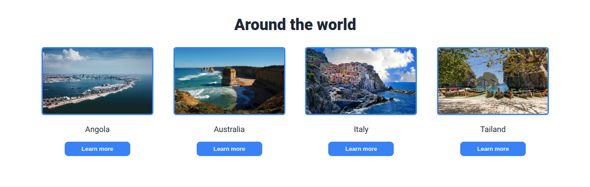
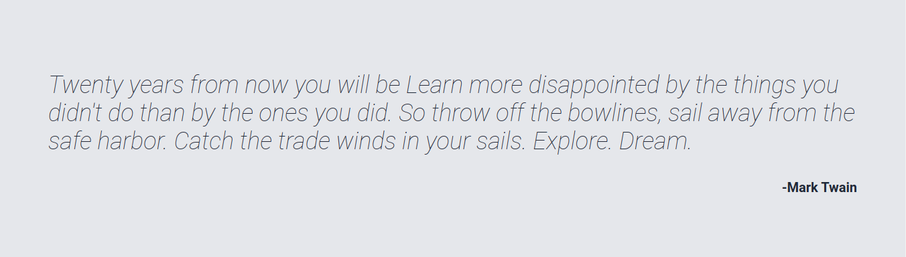

# Landing page created for The Odin Project
 This landing page was created using only HTML and CSS
## Reference images: 
 [Image01]

 [Image02]

### Links:
  [Repository](https://github.com/ggms13/landing-page)
  [Github Page](https://ggms13.github.io/landing-page/)

#### Screenshots: 

##### **Image credits:**
Foto de Florencia Potter no Pexels: https://www.pexels.com/pt-br/foto/cordilheira-e-corpo-d-agua-351283/   
Foto de Erik Karits: https://www.pexels.com/pt-br/foto/barcos-na-costa-3732494/   
Foto de Frans van Heerden: https://www.pexels.com/pt-br/foto/casas-de-cores-variadas-ao-lado-do-corpo-d-agua-632522/   
Foto de Paul Macallan: https://www.pexels.com/pt-br/foto/australia-oceania-penhasco-abismo-6465339/   
Foto de Carlos César: https://www.pexels.com/pt-br/foto/foto-aerea-de-edificios-proximos-a-costa-2767923/

[Image01]: https://cdn.statically.io/gh/TheOdinProject/curriculum/81a5d553f4073e593d23a6ab00d50eef8620796d/foundations/html_css/project/imgs/01.png
[Image02]: https://cdn.statically.io/gh/TheOdinProject/curriculum/81a5d553f4073e593d23a6ab00d50eef8620796d/foundations/html_css/project/imgs/02.png